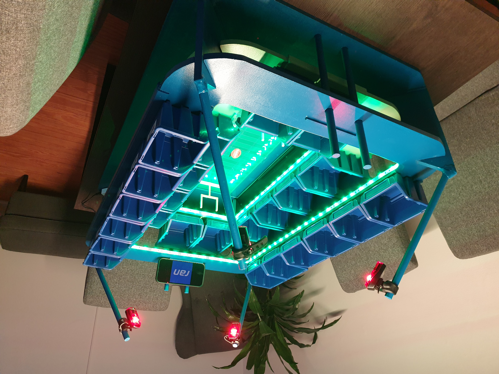

# Snack Stadium
 
This is a repository for a snack stadium, which is a fun way to serve snacks at your next party or event. The snack stadium is made up of various compartments that can hold different types of snacks, such as chips, pretzels, candy, and more.

# Getting Started
To get started with the snack stadium, you’ll need to gather the following materials:

## Material List

- 12 mm MDF Board
  - 2x 64x92 cm
  - 1x 54x82 cm
- 3x 14x1000 mm round bar
- 3x 22x22x1000 mm angle bar 
- 6x 5x5x1000 mm flat bar 
- UHU REPAIR ALL POWERKITT
- 8x 3x16 mm wood screws
- Polystyrene plate, transparent, 4x250x500 mm
- 14x small Boxes, blue, Size 1
- 12x normal/big Boxes, blue, size 2(B)
- LED-stripes, ~2 m
- 4x bike backlights
- Acryl paint, blue
- Acryl spray paint, rasp yellow
- 4x adhesive feet

## Setup Guide
Have all of your materials, you can start building your snack stadium by following these steps:

**Detailed Steps TBD**

Mainly sticked to the inspiration, but did some things different (e.g. some values in instruction were wrong, used UHU REPAIR ALL POWERKITT instead of sets of chair angles, different sizes of boxes).
Did not document the process properly in Github, but will try to update the changes if someone is interested.

In the repository you can find CAD Models of all Parts created with Catia V5.

When done, fill each compartment with your desired snacks. 

# Acknowledgments
I got the main inspiration for this snack stadium from [this DIY Video of Hagebau](https://www.youtube.com/watch?v=XJcGIodzV_0). I also added their [instruction PDF](pictures/DIY_Anleitung_Snack_Bowl_2021-41728-31678.pdf) to this repository in case it gets lost. 

I hope this helps! Let me know if you have any other questions or if there’s anything else I can do for you.

# How it looks 
Find some images below of the final product I made. The vertical bars are perfect to store any smartphone to be able to stream multiple games. 

